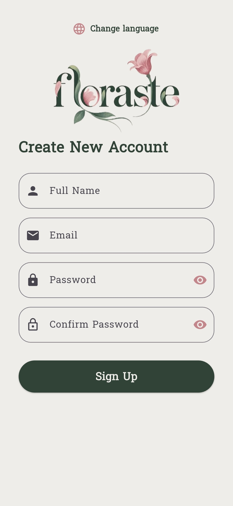
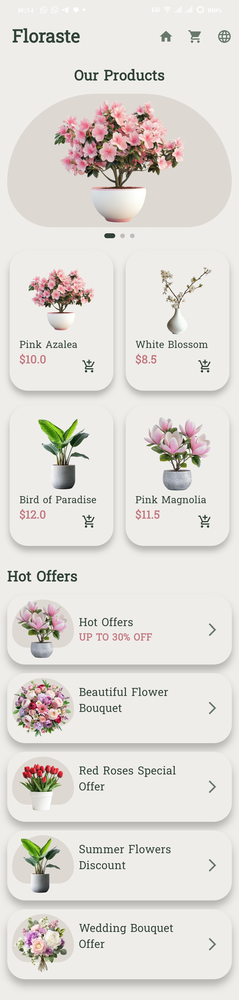

# 🌸 Floraste - Flower Shopping App

Floraste is a simple and elegant **Flutter flower shopping application** designed to provide users with a beautiful and easy-to-use interface for browsing flowers and special offers.

The project demonstrates Flutter UI development, form validation, navigation, localization, responsive design, reusable widgets, and basic shopping interactions.

---

## ✨ Features

- 🌸 Beautiful and user-friendly flower shopping interface.
- 📝 Sign Up form with input validation.
- ✅ Validation for:
  - Full name
  - Email
  - Password
  - Confirm password
- 🎉 Success dialog after creating an account.
- 🛍️ Flower products displayed in a responsive grid.
- 🌺 Product images and prices.
- 🔥 Hot Offers section with special flower offers.
- 🛒 Add-to-cart interaction with a confirmation SnackBar.
- 🌎 English and Arabic language support.
- 🔄 Dynamic language switching at runtime.
- 📱 Responsive UI using `MediaQuery`.
- 🖼️ PageView for displaying product images.
- 🔘 Page indicators for the product image slider.
- 🧩 Reusable custom widgets organized into separate files.
- 🎨 Custom colors and font styling.
- 🏠 Navigation between application screens.
- 🌐 Displaying both local assets and a network image.

---

## 🌎 Localization

Floraste supports two languages:

- 🇺🇸 English
- 🇪🇬 Arabic

The application uses the **Easy Localization** package to manage translations and allows the user to switch between languages dynamically.

Translation files:

```text
Translation/
├── en-US.json
└── ar-EG.json
```

---

## 📸 Screenshots

### 📝 Sign Up Screen

<p align="center">
  
</p>

### 🌸 Shopping Screen

<p align="center">
  
</p>

---

## 🛠️ Technologies & Tools

- Flutter
- Dart
- Easy Localization
- Material Design
- MediaQuery
- PageView.builder
- GridView.builder
- ListView.builder
- Form & TextFormField
- Navigator
- SnackBar
- VS Code / Android Studio

---

## 🚀 How to Run
1. Make sure [Flutter](https://flutter.dev) is installed on your machine.
2. Clone the repository:
   ```bash
   git clone https://github.com/habibafekry3/Floraste.git
3. Navigate to the project folder:
   ```bash
   cd Floraste
4. Install dependencies:
```bash
flutter pub get
```
5. Run the application:
```bash
flutter run
```

---

## 📚 Educational Purpose

This project was developed as part of a Flutter learning journey, focusing on responsive UI, localization, form validation, and reusable widget architecture.

---

## 👩‍💻 Author
Habiba Fekry


